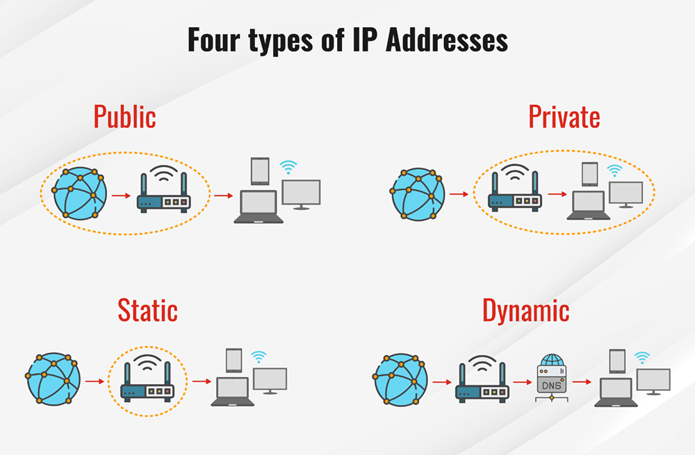

# Week 5 : 네트워크 설정 및 보안

<aside>

네트워크 기본 개념과 인터페이스 구성 이해, nmcli·nmtui를 활용한 IP/게이트웨이/DNS 설정, 네트워크 상태 점검 도구 활용(ping, ss, ip), 방화벽(firewalld) 정책 설정, SELinux 동작 방식과 기본 보안 정책 이해

</aside>

## 문서 구성

1. TCP 소켓과 UDP 소켓
2. 학습 목표
3. 네트워크 기본 개념
4. 네트워크 인터페이스 구성 이해
5. `nmcli`를 활용한 네트워크 설정
6. `nmtui`를 활용한 네트워크 설정
7. 네트워크 상태 점검 도구
8. 네트워크 문제 점검 순서
9. `firewalld` 정책 설정
10. SELinux 기본 개념
11. 네트워크 + 방화벽 + SELinux 통합 사고방식
12. 실습

---

---

# 2. 네트워크 기본 개념

## 2-1. 네트워크 인터페이스란?

컴퓨터나 네트워크 장치가 네트워크에 연결되도록 도와주는 물리적 또는 가상 장치를 말한다. 네트워크 인터페이스를 통해 데이터가 컴퓨터와 네트워크 사이에서 송수신된다.

### 네트워크 인터페이스(Network Interface) 주요 역할

**i. 데이터 송수신**

네트워크 인터페이스는 데이터를 패킷 형태로 변환하여 네트워크를 통해 전송하거나 수신한 데이터를 처리한다.

**ii. 주소 관리**

네트워크 인터페이스는 고유한 식별자인 MAC 주소를 통해 네트워크 상의 다른 장치와 통신한다.

**iii. 프로토콜 처리**

TCP/IP 같은 네트워크 프로토콜 스택과 협력하여 데이터 전송을 관리한다.

---

### 네트워크 인터페이스(Network Interface) 구성 요소

**i. NIC (Network Interface Card)**

1. 물리적 네트워크 인터페이스로, 컴퓨터나 서버에 설치되는 하드웨어 카드다.
Ex) 이더넷 카드, 무선 LAN 카드
2. 내장형 NIC: 대부분의 현대 컴퓨터에 기본적으로 포함된 형태
3. 외장형 NIC: USB 포트 등을 통해 추가로 연결되는 형태

**ii. MAC 주소 (Media Access Control Address)**

네트워크 인터페이스의 고유 식별자로, 장치 제조 시 할당된다. 48비트 크기의 주소 체계로 구성되며, 네트워크에서 데이터 송수신 시 장치를 구분하는 데 사용된다.

**iii. 인터페이스 유형**
- 유선 네트워크 인터페이스: Ethernet 기반의 연결, RJ45 포트를 사용
- 무선 네트워크 인터페이스: Wi-Fi, Bluetooth, 5G 등의 무선 기술을 사용

**iv. 속도와 대역폭**

네트워크 인터페이스의 성능은 지원하는 대역폭과 데이터 전송 속도에 따라 다르다.

예) 10Mbps, 100Mbps, 1Gbps, 10Gbps

---

### 네트워크 인터페이스(Network Interface) 유형

**i. 물리적 인터페이스**

이더넷 포트, 광섬유 포트, 무선 LAN 칩셋 등을 포함한 실제 하드웨어

**ii. 가상 네트워크 인터페이스**

물리적 하드웨어 없이 소프트웨어적으로 구현된 인터페이스

예) 가상 LAN(VLAN), 터널링(VPN) 인터페이스

### 네트워크 인터페이스(Network Interface) 동작 과정

데이터는 애플리케이션 계층에서 시작하여 네트워크 계층을 통해 패킷으로 변환된다.

패킷은 네트워크 인터페이스로 전달되어 물리적 매체(Ethernet 케이블, Wi-Fi 등)를 통해 전송된다.

수신 장치의 네트워크 인터페이스가 패킷을 수신하여 다시 상위 계층으로 전달한다.

### 네트워크 인터페이스(Network Interface) 관리 및 설정

**i. 운영체제 설정**
1. Linux: ifconfig 또는 ip 명령어로 인터페이스 관리
2. Windows: 네트워크 어댑터 설정 창을 통해 관리 가능

**ii. 가상 인터페이스 생성**

Docker나 VMware 같은 가상화 플랫폼에서 사용되는 가상 네트워크 설정

---

### 네트워크 인터페이스(Network Interface) 관련 문제와 해결

**i. 연결 불가 문제**

원인: 하드웨어 손상, 드라이버 미설치, IP 설정 오류

해결: 드라이버 재설치, IP 설정 확인, 케이블 연결 확인

**ii. 속도 저하 문제**

원인: 대역폭 제한, 네트워크 혼잡

해결: 고속 NIC 사용, 네트워크 트래픽 관리

예:
- `ens33`
- `enp0s3`
- `eth0`

즉, 서버가 네트워크와 통신하려면 먼저 인터페이스가 있어야 하고, 그 인터페이스에 IP 주소가 붙어 있어야 한다.

### 확인 명령

```bash
ip link
```

### 해석 포인트

- `UP`이면 인터페이스가 활성화된 상태
- `DOWN`이면 비활성화 상태
- `LOWER_UP`이면 실제 링크 연결도 정상인 경우가 많음

---

## 2-2. IP 주소

IP 주소는 네트워크 상에서 장치를 식별하는 주소다.

예:

```bash
192.168.10.20/24
```

이 의미는 다음과 같다.

- `192.168.10.20` : 호스트 주소
- `/24` : 네트워크 범위(prefix)

`/24`는 서브넷 마스크 `255.255.255.0`과 같은 의미다.

즉,

- 같은 네트워크 대역이면 직접 통신 가능
- 다른 대역이면 게이트웨이를 거쳐야 함

### IP 주소 기본 설명

**인터넷 프로토콜(IP) 주소**는 인터넷에 연결된 모든 장치에 할당된 고유 식별 번호이다. IP 주소 정의는 인터넷을 사용하여 통신하는 장치에 할당된 숫자 레이블이다. 인터넷 또는 로컬 네트워크를 통해 통신하는 컴퓨터는 IP 주소를 사용하여 특정 위치에 정보를 공유한다.

IP 주소에는 두 가지 버전 또는 표준이 있다. 인터넷 프로토콜 버전 4(IPv4) 주소는 둘 중 오래된 것으로, 최대 40억 개의 IP 주소를 저장할 공간이 있으며 모든 컴퓨터에 할당된다. 최신 인터넷 프로토콜 버전 6(IPv6)에는 수조 개의 IP 주소가 있으며, 이는 컴퓨터 외에도 새로운 종류의 장치를 차지한다. 또한 공용, 개인, 정적 및 동적 IP 주소를 포함한 여러 유형의 IP 주소가 있다.

인터넷이 연결된 모든 장치에는 컴퓨터, 노트북, IoT 장치 또는 장난감 등 IP 주소가 있다. IP 주소를 사용하면 연결된 두 장치 간에 데이터를 효율적으로 전송할 수 있으므로 서로 다른 네트워크의 기계가 서로 통신할 수 있다.

**IP 주소는 어떻게 작동합니까?**

IP 주소는 인터넷에 액세스하는 기기와 관계없이 검색이 가능한 데이터 또는 콘텐츠를 찾는 데 도움이 된다.

IP 주소의 일반적인 작업에는 호스트 또는 네트워크의 식별 또는 장치의 위치 식별이 포함된다. IP 주소는 무작위가 아닙니다. IP 주소 생성에는 수학의 기초가 있다. 인터넷 할당 번호 기관(IANA)은 IP 주소와 그 생성을 할당한다. IP 주소의 전체 범위는 0.0.0.0에서 255.255.255.255까지이다.

IP 주소를 수학적으로 할당하면 대상에 연결하기 위한 고유한 ID를 만들 수 있다.



image.png

### 공용 IP 주소

공용 IP 주소 또는 외부 IP 주소는 사람들이 비즈니스 또는 가정용 인터넷 네트워크를 인터넷 서비스 제공업체(ISP)에 연결하는 데 사용하는 기본 장치에 적용된다. 대부분의 경우 라우터가 된다. 라우터에 연결하는 모든 장치는 라우터의 IP 주소를 사용하여 다른 IP 주소와 통신한다.

사람들이 온라인 게임, 이메일 및 웹 서버, 미디어 스트리밍, 원격 연결 생성에 사용되는 포트를 열려면 외부 IP 주소를 아는 것이 중요한다.

### 개인 IP 주소

사설 IP 주소 또는 내부용 IP 주소는 사무실 또는 가정용 인트라넷(또는 로컬 영역 네트워크)에서 장치에 할당하거나 인터넷 서비스 제공업체(ISP)에서 할당한다. 홈/사무실 라우터는 로컬 네트워크 내에서 개인 IP 주소를 연결하는 장치로 관리한다. 따라서 네트워크 장치는 라우터를 통해 개인 IP 주소에서 공용 IP 주소로 매핑된다.

사설 IP 주소는 여러 네트워크에서 재사용되므로 귀중한 IPv4 주소 공간을 보존하고 IPv4 주소 지정의 단순한 제한(4,294,967,296 또는 2^32) 이상으로 주소 지정성을 확장할 수 있다.

IPv6 주소 지정 체계에서는 모든 가능한 장치에 고유한 접두어가 있는 ISP 또는 기본 네트워크 조직에서 할당한 고유한 식별자가 있다. 개인 주소 지정은 IPv6에서 가능하며, 이를 사용하면 ULA(Unique Local Addressing)라고 한다.

### 정적 IP 주소

모든 공용 및 개인 주소는 정적 또는 동적으로 정의된다. 사용자가 장치의 네트워크에 수동으로 구성하고 수정하는 IP 주소를 정적 IP 주소라고 한다. 정적 IP 주소는 자동으로 변경할 수 없다. 인터넷 서비스 제공자는 정적 IP 주소를 사용자 계정에 할당할 수 있다. 각 세션에 대해 동일한 IP 주소가 해당 사용자에게 할당된다.

### 동적 IP 주소

라우터가 설정되면 동적 IP 주소가 네트워크에 자동으로 할당된다. **동적 호스트 구성 프로토콜(DHCP)**은 이 동적 IP 주소 집합의 배포를 할당한다. DHCP는 가정 또는 조직의 네트워크에 IP 주소를 제공하는 라우터일 수 있다.

사용자가 네트워크에 로그인할 때마다 사용 가능한(현재 할당되지 않은) IP 주소 풀에서 새 IP 주소가 할당된다. 사용자는 여러 세션에서 여러 IP 주소를 무작위로 순환할 수 있다.

### IPv4

IPv4는 IP의 네 번째 버전이다. 인터넷과 다른 네트워크를 상호 연결하는 데 사용되는 표준 기반 방법의 핵심 프로토콜 중 하나이다. 프로토콜은 1982년에 인터넷의 초기 단계 중 일부를 구성한 위성 네트워크인 Atlantic Packet Satellite Network(SATNET)에 처음 배포되었다. IPv6이 존재하더라도 대부분의 인터넷 트래픽을 라우팅하는 데 여전히 사용된다.

IPv4는 현재 모든 컴퓨터에 할당되어 있다. IPv4 주소는 32비트 바이너리 번호를 사용하여 고유한 IP 주소를 구성한다. 4개의 숫자 집합 형식을 취하며, 각 숫자는 0~255 범위이고 8자리 바이너리 숫자를 나타내며 마침표로 구분된다.

### IP 주소 클래스

일부 IP 주소는 IANA(Internet Assigned Numbers Authority)에서 예약한다. 일반적으로 장치를 상호 연결하는 데 사용되는 **전송 제어 프로토콜/인터넷 프로토콜(TCP/IP)**에서 특정 목적을 수행하는 네트워크에 사용된다. 이러한 IP 주소 클래스 중 4가지는 다음과 같다.

1. **0.0.0.0**: IPv4의 이 IP 주소는 기본 네트워크라고도 한다. 유효하지 않거나, 적용되지 않거나, 알 수 없는 네트워크 대상을 지정하는 라우팅 불가능한 메타 주소이다.
2. **127.0.0.1**: 이 IP 주소는 루프백 주소라고 하며, 컴퓨터가 IP 주소가 할당되었는지 여부에 관계없이 자신을 식별하는 데 사용한다.
3. **169.254.0.1 ~ 169.254.254.254**: 컴퓨터가 DHCP에서 주소를 수신하지 못하는 경우 자동으로 할당되는 주소 범위이다.
4. **255.255.255.255**: 네트워크의 모든 컴퓨터로 전송하거나 네트워크를 통해 브로드캐스트해야 하는 메시지 전용 주소이다.

추가로 예약된 IP 주소는 서브넷 클래스로 알려져 있다. 하위 네트워크는 라우터를 통해 더 큰 네트워크에 연결하는 작은 컴퓨터 네트워크이다. 서브넷에 자체 IP 주소 시스템을 할당할 수 있으므로, 서브넷에 연결된 모든 장치가 더 넓은 네트워크를 통해 데이터를 전송하지 않고도 서로 통신할 수 있다.

TCP/IP 네트워크의 라우터는 서브넷을 인식하도록 구성한 다음 트래픽을 적절한 네트워크로 라우팅할 수 있다. IP 주소는 다음 서브넷에 대해 예약된다.

1. **클래스 A**: IP 주소 10.0.0.0~10.255.255.255
2. **클래스 B**: 172.16.0.0~172.31.255.255 사이의 IP 주소
3. **클래스 C**: IP 주소 192.186.0.0~192.168.255.255
4. **클래스 D 또는 멀티캐스트**: 224.0.0.0에서 239.255.255.255 사이의 IP 주소
5. **클래스 E, 실험용으로 예약됨**: 240.0.0.0에서 254.255.255.254 사이의 IP 주소

Class A, Class B 및 Class C에 나열된 IP 주소는 서브넷 생성에 가장 일반적으로 사용된다. 멀티캐스트 또는 클래스 D 내의 주소에는 IETF(Internet Engineering Task Force) 지침에 명시된 특정 사용 규칙이 있지만, 공개용으로 클래스 E 주소를 공개한 것은 IPv6 표준이 도입되기 전에 많은 논쟁이 벌어졌다.

### IPv4 대 IPv6

IPv4는 단순한 휴대폰, 데스크톱 컴퓨터 및 노트북을 넘어 기기 수량과 범위가 폭발적으로 증가하는 상황에 대처할 수 없었다. 원래 IP 주소 형식은 생성되는 IP 주소 수를 처리할 수 없다.

이 문제를 해결하기 위해 IPv6이 도입되었다. 이 새로운 표준은 16진수 형식을 운영하므로 수십억 개의 고유한 IP 주소를 생성할 수 있다. 따라서 최대 43억 개의 고유 번호를 지원할 수 있는 IPv4 시스템은 이론적으로 무제한 IP 주소를 제공하는 대안으로 대체되었다.

그 이유는 IPv6 IP 주소가 4개의 16진수 숫자가 포함된 8개 그룹으로 구성되며, 0~9의 16개의 고유한 기호와 10~15의 값을 나타내는 A~F를 사용한다.

출처: https://www.fortinet.com/kr/resources/cyberglossary/what-is-ip-address

---

## 2-3. IP 주소와 서브넷 마스크

### IP 주소

IP 주소는 **네트워크 상에서 각 기기를 구별하기 위한 고유한 번호**이다.

IPv4 주소는 **32비트**로 구성되며, 보통 **10진수 4개 묶음(8비트씩)**으로 표현된다.

예:

**192.168.1.132** → 32비트 중 앞 8비트씩 4묶음 = 192.168.1.132

### IP 주소의 두 가지 정보

- **네트워크(Network) 부분**: 어느 네트워크에 속했는가?
- **호스트(Host) 부분**: 네트워크 안에서 어떤 기기인가?

이 네트워크와 호스트의 경계를 정해주는 것이 바로 **서브넷 마스크**이다.

---

### 서브넷 마스크

서브넷 마스크는 **고정된 네트워크 영역을 1로, 바뀌는 호스트 영역을 0으로 표시**한 32비트 값이다.

예:

**/24** → 11111111.11111111.11111111.00000000 → 255.255.255.0

| 표현 | 비트로 표현 | 10진수 표현 |
| --- | --- | --- |
| **/20** | 앞 20개가 1, 나머지 12개는 0 | 255.255.240.0 |
| **/24** | 앞 24개가 1 | 255.255.255.0 |
| **/26** | 앞 26개가 1 | 255.255.255.192 |
- **1의 개수** = 네트워크 영역
- **0의 개수** = 호스트 영역 → 0의 개수가 많을수록 한 네트워크 안에 더 많은 기기를 수용할 수 있음

---

### 서브넷 주소 계산 시 알아야 할 공식들

| 항목 | 공식 |
| --- | --- |
| 총 IP 수 | 2^(32 - 네트워크 비트 수) |
| 사용 가능한 호스트 수 | 총 IP 수 - 2 (네트워크 주소, 브로드캐스트 주소 제외) |
| 변화 단위 | 256 - 서브넷 마스크 해당 옥텟의 값 |

예를 들어 **/20**이면:

- 총 IP 수: 2¹² = 4096개
- 사용 가능한 호스트 수: 4094개
- 3번째 옥텟에서 변화 단위: 256 - 240 = 16

---

### 브로드캐스트 주소와 네트워크 주소

- **네트워크 주소**: 해당 IP 범위의 가장 첫 번째 주소. 이 주소는 네트워크 자체를 나타내므로 **호스트로 사용 불가**
- **브로드캐스트 주소**: 해당 IP 범위의 가장 마지막 주소. **네트워크 전체에게 메시지를 보낼 때 사용**, 역시 **호스트로 사용 불가**

---

### 기출 문제 풀이

### 문제 1. /20 서브넷에서 첫 번째 호스트 IP 구하기

> **172.16.0.0/20 네트워크에서, 172.16.7.50이 속한 서브넷의 사용 가능한 첫 번째 호스트 IP는?**
> 

### 풀이

**1단계: 서브넷 마스크 해석**
- /20은 앞에서부터 20비트가 네트워크 주소라는 의미이다.
- IP 주소는 32비트이므로, 나머지 32 - 20 = 12비트는 **호스트 주소 영역**이다.
- 이는 2¹² = **4096개의 IP 주소**가 있다는 뜻이다.

**2단계: IP 범위 찾기**
- 172.16.0.0부터 시작한다고 했을 때,
- **블록 단위**는 2¹² = 4096개 IP
- 따라서 네트워크 주소의 범위는: **브로드캐스트 주소 = 172.16.0.0 + 4096 - 1 = 172.16.15.255**
- **네트워크 주소 = 172.16.0.0**
- 즉, 이 서브넷의 범위는: 172.16.0.0 ~ 172.16.15.255

**3단계: 해당 IP가 속해 있는지 확인**
- 172.16.7.50은 위 범위 안에 포함되므로, 이 서브넷이 맞다.

**4단계: 사용 가능한 첫 IP 주소 찾기**
- **네트워크 주소**는 172.16.0.0 → 사용 불가
- **사용 가능한 첫 번째 호스트 주소**는 네트워크 주소 **+ 1**: `172.16.0.1`

정답: **172.16.0.1**

---

### 문제 2. /24 네트워크를 3개의 FLSM 서브넷으로 나눈 경우

> **192.168.1.0/24 네트워크를 FLSM 방식으로 3개로 나눌 때, 두 번째 서브넷의 브로드캐스트 주소는?**
> 

### 풀이

**1단계: IP 개수 확인**
- /24는 256개 IP 주소를 가진다 (2⁸ = 256)

**2단계: FLSM이란?**
- FLSM(Fixed Length Subnet Mask)은 모든 서브넷이 동일한 크기를 가진다.
- 3개로 동일하게 나눌 수는 없다 → **가장 가까운 2의 제곱인 4개**로 나눈다 (2² = 4)

**3단계: 서브넷당 크기 계산**
- 256 IP / 4 = 64개 IP씩 나눔
- 서브넷 주소 범위:

| 서브넷 번호 | 네트워크 주소 | 브로드캐스트 주소 |
| --- | --- | --- |
| 1번 | 192.168.1.0 | 192.168.1.63 |
| 2번 | 192.168.1.64 | 192.168.1.127 |
| 3번 | 192.168.1.128 | 192.168.1.191 |
| 4번 | 192.168.1.192 | 192.168.1.255 |

정답: **192.168.1.127**

---

### 문제 3. /26 서브넷에서 네트워크 주소와 호스트 수 계산

> **IP 주소: 192.168.1.132, 서브넷 마스크: 255.255.255.192 해당 서브넷의 ① 네트워크 주소와 ② 사용 가능한 호스트 수는?**
> 

### 풀이

**1단계: 마스크 확인**
- 255.255.255.192는 이진수로 `11111111.11111111.11111111.11000000` → **26비트 네트워크 (/26)**
- 남은 **6비트가 호스트 영역** → 2⁶ = 64개의 IP 주소
- 사용 가능한 호스트 수 = 64 - 2 = **62개** (네트워크, 브로드캐스트 제외)

**2단계: 192.168.1.x 대역을 64개씩 나누기**

| 서브넷 번호 | 네트워크 주소 | 브로드캐스트 주소 |
| --- | --- | --- |
| 1번 | 192.168.1.0 | 192.168.1.63 |
| 2번 | 192.168.1.64 | 192.168.1.127 |
| 3번 | 192.168.1.128 | 192.168.1.191 |
| 4번 | 192.168.1.192 | 192.168.1.255 |
- 192.168.1.132는 3번에 포함됨

정답:
- ① **192.168.1.128**
- ② **62개**

---

### 정리

- **서브넷 마스크는 IP 주소의 경계를 정한다.**
- **/숫자 → 네트워크 비트 수**
- **총 IP 수 = 2^(남은 비트 수)**
- **호스트 수 = 총 IP - 2** (네트워크 주소 + 브로드캐스트 제외)
- **변화 단위 = 256 - 해당 옥텟의 서브넷 마스크 값**
- **브로드캐스트 주소 = 서브넷 범위의 가장 마지막 IP**

출처: https://rxxm.tistory.com/95

---

## 2-4. Gateway

서로 다른 네트워크가 만나는 지점에서 통신이 가능하게 해주는 장치나 소프트웨어

1. 네트워크 입장에서 보면, 게이트웨이는 해당 네트워크에서 다른 네트워크로 나가는 출구이며, 다른 네트워크로 들어가는 입구이다.
2. 데이터 입장에서 보면, 게이트웨이는 데이터가 외부 네트워크로 나거나 외부 네트워크로 들어갈 때 반드시 지나가야 하는 통로이다.
3. 또한 호스트 기기에서 보면, 게이트웨이는 로컬 호스트들이 외부망의 호스트 기기와 통신하려 할 때, 반드시 도달해야 하는 접속 지점이다.

### 게이트웨이는 왜 필요한가?

동일한 네트워크에 있는 소수의 호스트 컴퓨터 간에 통신은 대상 간에 직접 통신을 하면 되기 때문에 통신 경로가 아주 단순하다. 그냥 서로 통신하면 된다.


( 직접 통신 경로 )

그러나 서로 다른 네트워크에 있는 다수의 호스트 컴퓨터들이 서로 통신을 할 경우에는, 대상 간에 직접 통신을 하면 통신 경로가 아주 방대해지고 복잡해지기 때문에, 매우 비효율적이고 관리하기도 어렵다.


( 다수, 다자 간에 통신 경로 )

따라서 통신 경로를 단순화하고, 연결 회선을 효율적으로 관리하기 위해서 다수의 호스트들을 여러 그룹으로 나누고, 각 그룹의 호스트들은 한 지점에 공통적으로 접속하게 하며, 각 그룹의 공통된 지점을 다시 서로 연결하면, 다수 간의 통신 경로가 매우 단순화된다. 그리고 이때 각 그룹의 공통된 접속 지점이 바로 게이트웨이라 한다.


( 게이트웨이 사용 통신 경로 )

즉, 게이트웨이는 네트워크의 복잡한 연결을 단순화하고 효율적으로 관리하기 위해 반드시 필요한 기술이다.

종합해 보면, 게이트웨이란 다른 네트워크로 나가거나 다른 네트워크에서 들어오도록 하기 위해 꼭 필요한 통신 기기(로컬 호스트 중 하나)의 일부분이며, 통신 데이터가 다른 네트워크의 호스트와 통신하기 위해서 반드시 통과해야 하는 내부의 출입문이라 하겠다.

그래서 만약 해당 네트워크의 외부에 있는 호스트 컴퓨터와 통신하지 않고 내부에 있는 호스트 컴퓨터들 간의 통신만 수행한다면 게이트웨이는 불필요하며,


( 해당 네트워크의 호스트 간에 통신 : 게이트웨이 불필요 )

해당 네트워크의 외부에 있는 호스트 컴퓨터와 통신이 필요하다면 반드시 게이트웨이가 있어야 한다.


Gateway는 다른 네트워크로 나갈 때 거쳐가는 출구다.


특히 **Default Gateway**는 외부 네트워크로 나갈 때 기본으로 사용하는 다음 홉이다.

### 게이트웨이의 주소

게이트웨이 주소는 4개의 옥테트(`xxx.xxx.xxx.xxx`)로 구성되어 있으며, 호스트 컴퓨터의 IP 주소의 일종이다. 즉 게이트웨이도 동일 네트워크에 있는 여러 호스트 컴퓨터들 중의 하나이며, 단지 외부로 나가거나 외부에서 들어오는 출입구 역할을 하는 특별한 장비의 일부분일 뿐이다.

예를 들어 네트워크 대역이 `192.168.0.0 ~ 192.168.0.255`로 구성되어 있다면, 해당 대역의 IP 개수는 256개이다. 하지만 해당 네트워크의 제일 첫 번째 주소인 `192.168.0.0`은 네트워크 주소이며, 제일 마지막 주소인 `192.168.0.255`는 브로드캐스트 주소이고, 이 두 개의 주소는 호스트 컴퓨터에 할당할 수 없는 IP 주소이다. 따라서 해당 대역에서 실제적으로 사용 가능한 IP 주소는 `192.168.0.1 ~ 192.168.0.254`로 254개이다.

여기서 게이트웨이의 주소는 사용자가 254개의 주소 중에 임의로 선택하여 지정할 수 있다. 통상은 위의 2개의 주소(네트워크 주소, 브로드캐스트 주소)를 제외한 사용 가능한 주소(254개) 중에 첫 번째 주소인 `192.168.0.1`로 지정하거나 또는 마지막 주소인 `192.168.0.254`로 지정한다.

네트워크 게이트웨이는 네트워크 경계에서 서로 다른 프로토콜과 데이터 형식 간의 변환을 수행하여 네트워크를 연결하는 작업을 수행한다. 회사는 게이트웨이를 배포하여 회사 LAN을 공용 인터넷에 연결하거나 IT 및 OT 네트워크와 같은 다른 내부 네트워크를 연결할 수 있다.

네트워크 게이트웨이는 다음과 같은 다른 주요 네트워크 및 보안 어플라이언스와 결합할 수 있다. Firewall. 그러나 전용 네트워크 게이트웨이는 라우터, 브리지 및 방화벽과 다른 기능을 가지고 있다.

게이트웨이와 네트워크 라우터는 모두 서로 다른 네트워크 간에 트래픽을 전달할 수 있다. 그러나 두 디바이스 모두 두 개의 네트워크를 연결할 수 있고 라우터는 네트워크 게이트웨이의 일부 기능을 수행할 수 있지만 서로 다른 기능을 수행한다.

네트워크 게이트웨이와 라우터의 주요 차이점은 서로 다른 프로토콜을 사용하는 두 개의 서로 다른 네트워크를 연결하는 게이트웨이의 기능이다. 라우터는 원본에서 최종 목적지까지의 경로를 따라 패킷을 전달하는 데 중점을 두는 반면, 게이트웨이의 변환 기능을 사용하면 네트워크 경계를 통과할 때 네트워크 트래픽에 사용되는 프로토콜을 변환할 수 있다.

예:
- 내 서버 IP: `192.168.10.20/24`
- Gateway: `192.168.10.1`

이 경우
- `192.168.10.x` 대역은 직접 통신 가능
- 그 외 주소는 `192.168.10.1`로 보냄

### 확인 명령

```bash
ip route
```

### 예시

```bash
default via 192.168.10.1 dev ens33
192.168.10.0/24 dev ens33 proto kernel scope link src 192.168.10.20
```

### 해석

- `default via 192.168.10.1` : 기본 게이트웨이
- `dev ens33` : 해당 라우팅에 사용하는 인터페이스

### 게이트웨이 주소 확인하는 방법

우리가 게이트웨이를 가장 가까이서 경험할 수 있는 장비는 유무선 공유기이다. 유무선 공유기가 곧 게이트웨이는 아니지만, 유무선 공유기는 게이트웨이의 역할을 하는 대표적인 장비 중의 하나이다.


( IpTIME 유무선 공유기 )

만약 내 PC가 유무선 공유기에 접속되어 있다면,

**1) 명령 프롬프트 화면에서 확인하기**
- [윈도우] + [R] → CMD 입력 및 실행 → 명령 프롬프트 화면 → `ipconfig` 실행 → 기본 게이트웨이 주소 확인


( KT 유무선 공유기를 사용하는 네트워크의 게이트웨이 주소 확인 )

KT 유무선 공유기에 연결되어 있는 내 PC의 기본 게이트웨이 주소는 `172.30.1.254`임을 확인할 수 있다. 즉, 호스트 컴퓨터들의 게이트웨이 주소는 브로드캐스트 주소(`172.30.1.255`)를 제외한, 대역의 마지막 주소인 `172.30.1.254`이다. 따라서 외부로 나가는 내 PC의 모든 데이터는 게이트웨이(`172.30.1.254`)를 통하여 외부 네트워크로 나간다.

**2) 제어판에서 확인하기**
- 제어판 → 네트워크 및 공유 센터 → 인터넷 Wi-Fi(더블클릭) → [자세히] 클릭 → IPv4 기본 게이트웨이 확인

( Iptime 유무선 공유기를 사용하는 네트워크의 게이트웨이 주소 확인 )

Iptime 유무선 공유기에 연결되어 있는 내 PC의 기본 게이트웨이 주소는 제어판에서 `192.168.0.1`임을 확인할 수 있다.

즉 호스트 컴퓨터들의 게이트웨이 주소는 네트워크 주소(`192.168.0.0`)를 제외한, 대역의 첫 번째 주소인 `192.168.0.1`이다. 따라서 외부로 나가는 내 PC의 모든 데이터는 게이트웨이(`192.168.0.1`)를 통하여 외부 네트워크로 나간다.

### 유무선 공유기에서 내부 IP 주소란

내 컴퓨터의 기본 게이트웨이 주소를 알았다면, 이제 유무선 공유기의 관리자 페이지에 진입하여 유무선 공유기의 외부 IP 주소와 내부 IP 주소를 확인하여 본다.

웹 브라우저 주소창 → 호스트 컴퓨터의 게이트웨이 주소 입력 → IpTIME 로그인 화면 접속 → 로그인 이름/로그인 암호 입력 → 시스템 요약 정보 → 외부 IP 주소 / 내부 IP 주소 확인


( Iptime 유무선 공유기의 시스템 요약 정보 )

Iptime 유무선 공유기의 시스템 요약 정보에서 외부 IP 주소와 내부 IP 주소를 확인할 수 있는데, 공유기의 내부 IP 주소가 내 컴퓨터의 게이트웨이 주소(`192.168.0.1`)와 일치함을 알 수 있다.

즉, 유무선 공유기에서 내부 IP 주소는 해당 네트워크에 속한 호스트 컴퓨터들이 다른 네트워크와 연결하기 위해 반드시 접속해야 하는 지점(게이트웨이)의 주소이다.

*해당 컴퓨터의 기본 게이트웨이 주소는 유무선 공유기의 내부 IP 주소이다.*


image.png

### 게이트웨이와 라우터

누군가는 라우터를 게이트웨이라고도 하는데, 게이트웨이는 라우터가 아니다. 라우터는 패킷 데이터가 목적지까지 도달할 수 있도록 최적의 경로를 찾아서 안내하는 역할을 하며, 게이트웨이는 다른 네트워크로 통하는 출입구 역할을 한다. 따라서 둘은 통신 과정에서 서로 완전히 다른 역할을 한다.

이렇게 둘을 오해하는 이유는 유무선 공유기가 라우팅뿐만 아니라 NAT, 방화벽, 게이트웨이, 스위칭 기능 등이 포함된 복합 통신 기기이기 때문이며, 둘을 서로 구분하지 않고 편의상 혼용해서 사용하기 때문이라 생각된다.

### AWS에서 제공하는 게이트웨이(특정 분야를 전담하는 전문가들)

1. **Internet Gateway(인터넷 게이트웨이)**
    - VPC 내의 인스턴스가 **외부(인터넷)와 통신**할 수 있도록 해주는 수평 확장형, 고가용성 게이트웨이
    - IPv4, IPv6 트래픽을 지원하며, 인터넷 게이트웨이를 배치하면 퍼블릭 서브넷의 리소스를 인터넷에 연결할 수 있음
2. **NAT Gateway(NAT 게이트웨이)**
    - NAT란? Network Address Translation(네트워크 주소 변환)
    - NAT Gateway는 AWS에서 제공하는 네트워크 주소 변환 서비스
    - **프라이빗 서브넷 인스턴스가 VPC 외부(인터넷) 연결**을 시작할 수 있도록 함
    - NAT 게이트웨이를 사용하기 위해서는 **퍼블릭 서브넷에서 퍼블릭 NAT 게이트웨이(기본값)를 생성**한 뒤, Elastic IP(탄력적 IP 주소)를 NAT 게이트웨이와 연결해야 함
3. **AWS Transit Gateway(전송 게이트웨이)**
    - 여러 VPC와 온프레미스 네트워크를 **중앙 허브**를 통해 네트워크 관리를 단순화하고 확장성을 제공
    - 다수의 온프레미스 네트워크, 다수의 VPC를 **중앙에서 관리**할 때 사용 => 글로벌 확장도 매우 좋음
    - 모든 네트워크 트래픽은 자동으로 암호화
4. **Amazon API Gateway**
    - RESTful API 및 WebSocket API 생성, 게시, 유지, 모니터링 및 보호하기 위한 AWS 서비스
    - 개발자가 **API를 손쉽게 관리**할 수 있도록 지원하는 완전 관리형 서비스
5. **AWS Direct Connect Gateway**
    - **Direct Connect(물리적 연결)를 통해 여러 VPC를 서로 다른 리전에 걸쳐 연결**할 수 있는 게이트웨이
    - 타 계정에도 가능
    - Direct Connect Gateway를 Transit Gateway 혹은 Virtual Private Gateway와 연결하여 사용할 수 있음
6. **Virtual Private Gateway(가상 사설 게이트웨이)**
    - **VPC —– 온프레미스 네트워크 간** VPN(Virtual Private Network) 연결 설정 서비스
    - Direct Connect와 함께 사용되며 직접 연결하거나 프라이빗 가상 인터페이스와 연결됨
    - *프라이빗 가상 인터페이스란?* 물리적 연결 위에 설정되는 논리적 인터페이스로, 특정 VPC에 대한 프라이빗 경로를 제공하며 퍼블릭 인터넷을 거치지 않고 AWS와 온프레미스 간에 전용 네트워크 경로를 설정할 수 있음
    - `[Direct Connect Gateway --------- Virtual Private Gateway]`
    - `[Direct Connect Gateway --------- Virtual Interface --------- Virtual Private Gateway]`
7. **AWS VPN Gateway**
    - **VPC와 온프레미스 네트워크 간 VPN 연결** 설정하기 위한 엔드포인트 역할
    - `[온프레미스 ------ VPN ------ VPC]`
    - 보통 Site-to-Site VPN을 사용하여 인터넷 프로토콜 보안(IPsec) VPN 연결을 지원함으로써 서로 다른 네트워크 간 트래픽을 전달할 수 있음
8. **AWS Storage Gateway1. S3 File Gateway2. FSx File Gateway3. Volume Gateway4. Tape Gateway**
    - **온프레미스 IT 환경과 AWS 스토리지 인프라 사이에서 원활한 통합**이 이루어지도록 지원하는 서비스
    - **하이브리드 스토리지 솔루션** 제공
    - S3 File Gateway, FSx File Gateway, Tape Gateway, Volume Gateway 지원
    - 온프레미스를 S3 스토리지에 연결하여 데이터 액세스 시간 감소, 데이터 전송 관리, 확장성을 제공해줌
    - **SMB, NFS** 기반 액세스 제공
    - 사용 사례: 백업 및 아카이빙, 애플리케이션 통합, 온프레미스 서버 간 파일 공유
    - 온프레미스 시설에서 Windows 파일 서버용 클라우드인 FSx 파일 공유에 대한 짧은 지연 시간과 효율적인 액세스 제공
    - 사실상 무제한의 Windows 파일 공유에 원활하게 액세스할 수 있음
    - 사용 사례: 고성능 컴퓨팅, 빅 데이터 분석, 엔터프라이즈 애플리케이션
    - 블록 스토리지 워크로드 지원. 캐시 모드(Cached Volumes), 저장 모드(Stored Volumes)로 제공
    - Cached Volumes: 데이터 대부분 S3에 저장하고 자주 사용하는 데이터 로컬에 캐싱
    - Stored Volumes: 모든 데이터 로컬 저장, S3에 백업 스냅샷 생성
    - 사용 사례: 재해 복구, 데이터 아카이빙, 고성능 애플리케이션
    - 온프레미스 백업 애플리케이션(물리적 테이프)을 가상 테이프 라이브러리를 통해 S3, Glacier에 데이터를 저장할 수 있도록 지원
    - 사용 사례: 테이프 백업 클라우드 전환, 장기 데이터 보관, 재해 복구

### ① L3 (네트워크 계층) 게이트웨이

단순히 IP 주소를 보고 길을 찾아주거나 주소를 바꿔주는 역할을 한다. 가장 일반적인 형태다.

- **해당 서비스:** Internet Gateway, NAT Gateway, Transit Gateway
- **특징:** 패킷의 출발지와 목적지만 보고 빠르게 전달한다.

### ② L7 (애플리케이션 계층) 게이트웨이

데이터의 ’내용’까지 읽어서 처리하는 똑똑한 게이트웨이이다.

- **해당 서비스:** **Amazon API Gateway**
- **특징:** 단순 연결을 넘어 “이 사용자가 권한이 있는가?”, “데이터 형식이 맞는가?”까지 검사한다.

### ③ 클라우드 특화(하이브리드) 게이트웨이

전통적인 물리 네트워크에는 없었지만, 클라우드와 기존 본사 망을 잇기 위해 탄생한 형태다.

- **해당 서비스:** Storage Gateway, Direct Connect Gateway

---

## 2-5. DNS

DNS는 사람이 읽는 이름을 IP 주소로 바꿔주는 시스템이다.

도메인 이름 시스템(DNS)은 사람이 읽을 수 있는 도메인 이름(예: `www.amazon.com`)을 머신이 읽을 수 있는 IP 주소(예: `192.0.2.44`)로 변환한다.

스마트폰이나 노트북부터 대규모 소매 웹 사이트의 콘텐츠를 서비스하는 서버에 이르기까지 인터넷상의 모든 컴퓨터는 숫자를 사용하여 서로를 찾고 통신한다. 이러한 번호를 **IP 주소**라고 한다. 웹 브라우저를 열고 웹 사이트로 이동할 때는 긴 숫자를 기억해 입력할 필요가 없다. 대신 `example.com` 같은 **도메인 이름**을 입력해도 여전히 올바른 위치에 있을 수 있다.

Amazon Route 53과 같은 DNS 서비스는 `www.example.com` 같이 사람이 읽을 수 있는 이름을 컴퓨터가 서로 연결하는 데 사용하는 `192.0.2.1`과 같은 숫자 IP 주소로 변환하는 전 세계에 분산된 서비스이다. 인터넷의 DNS 시스템은 이름과 숫자 간의 매핑을 관리하여 마치 전화번호부와 같은 기능을 한다. DNS 서버는 이름을 IP 주소로 변환하여 도메인 이름을 웹 브라우저에 입력할 때 최종 사용자를 어떤 서버에 연결할 것인지를 제어한다. 이러한 요청을 **쿼리(query)**라고 한다.

예:
- `google.com` → `142.x.x.x`

즉,
- IP 통신은 되는데 도메인 접속이 안 되면
- DNS 문제일 가능성이 높다

### DNS는 트래픽을 웹 애플리케이션에 어떻게 라우팅합니까?

1. 사용자가 웹 브라우저를 열어 주소 표시줄에 `www.example.com`을 입력하고 Enter 키를 누릅니다.
2. `www.example.com`에 대한 요청은 일반적으로 케이블 인터넷 공급업체, DSL 광대역 공급업체 또는 기업 네트워크 같은 ISP가 관리하는 DNS 해석기로 라우팅된다.
3. ISP의 DNS 해석기는 `www.example.com`에 대한 요청을 DNS 루트 이름 서버에 전달한다.
4. ISP의 DNS 해석기는 `www.example.com`에 대한 요청을 이번에는 `.com` 도메인의 TLD 이름 서버 중 하나에 다시 전달한다. `.com` 도메인의 이름 서버는 `example.com` 도메인과 연관된 4개의 Amazon Route 53 이름 서버의 이름을 사용하여 요청에 응답한다.
5. ISP의 DNS 해석기는 Amazon Route 53 이름 서버 하나를 선택해 `www.example.com`에 대한 요청을 해당 이름 서버에 전달한다.
6. Amazon Route 53 이름 서버는 `example.com` 호스팅 영역에서 `www.example.com` 레코드를 찾아 웹 서버의 IP 주소 `192.0.2.44` 등 연관된 값을 받고 이 IP 주소를 DNS 해석기로 반환한다.
7. ISP의 DNS 해석기가 마침내 사용자에게 필요한 IP 주소를 확보하게 된다. 해석기는 이 값을 웹 브라우저로 반환한다. 또한, DNS 해석기는 다음에 누군가가 `example.com`을 탐색할 때 좀 더 빠르게 응답할 수 있도록 사용자가 지정하는 일정 기간 `example.com`의 IP 주소를 캐싱(저장)한다.

출처: https://aws.amazon.com/ko/route53/what-is-dns/

### 확인 명령

```bash
cat /etc/resolv.conf
```

### 예시

```bash
nameserver 8.8.8.8
nameserver 1.1.1.1
```

---

# 4. 네트워크 인터페이스 구성 이해

- NetworkManager는 리눅스 시스템에서 네트워크 연결을 관리하고 자동화하는 동적 네트워크 관리 도구다.
- 이 도구는 TUI(Text-based User Interface) 도구인 `nmtui`와 CLI(Command Line Interface) 도구인 `nmcli`를 포함한다.

### NetworkManager 활성화 및 데몬 확인

```bash
sudo systemctl enable NetworkManager
sudo systemctl restart NetworkManager
sudo systemctl status NetworkManager
```

핵심 개념

## 3-1. Device와 Connection Profile

### Device

실제 네트워크 장치

예:
- `ens33`

### Connection Profile

그 장치에 적용할 설정 묶음

예:
- 고정 IP
- gateway
- DNS
- DHCP 여부

즉, 실제로는 인터페이스 자체를 직접 만지기보다 **connection profile을 수정해서 설정을 반영**하는 구조라고 보면 된다.

## 3-2. DHCP와 Static IP

### DHCP

자동으로 IP, gateway, DNS를 받는 방식

장점:
- 편함
- 설정 자동화 쉬움

단점:
- 서버 운영에는 주소가 바뀔 수 있어 불편할 수 있음

### Static IP

관리자가 직접 고정 IP를 지정하는 방식

장점:
- 주소가 고정됨
- 서버 운영에 적합

단점:
- 직접 설정해야 함

## 들어가기 전

레드햇은 RHEL 8부터 `network-scripts (ifup, ifdown)` 대신 `NetworkManager(nmtui, nmcli)`를 기본 네트워크 관리 도구로 제공하고 있다. NetworkManager는 데몬으로 실행되어 약간의 리소스를 사용하지만, 더 직관적이고 편리한 네트워크 설정을 가능하게 한다.

네트워크 설정은 프로파일로 저장되며, 이 프로파일들은 `/etc/NetworkManager/system-connections/` 디렉터리에 저장된다.

---

# 5. `nmcli`를 활용한 네트워크 설정

`nmcli`는 NetworkManager를 CLI에서 다루는 도구다. 텍스트 기반 명령어를 사용하여 강력하고 유연한 네트워크 관리를 제공한다.

## 4-1. 현재 상태 확인

```bash
nmcli device status
nmcli connection show
```

의미:
- `nmcli device status` : 인터페이스 상태 확인
- `nmcli connection show` : 모든 connection 확인

추가로 자주 쓰는 확인 명령:

```bash
nmcli device show
nmcli con show
```

## 4-2. 정적 IP 설정

예시:
- 연결 이름: `ens33`
- IP: `192.168.10.20/24`
- Gateway: `192.168.10.1`
- DNS: `8.8.8.8`

```bash
nmcli connection modify ens33 \
  ipv4.method manual \
  ipv4.addresses 192.168.10.20/24 \
  ipv4.gateway 192.168.10.1 \
  ipv4.dns 8.8.8.8
```

설정 적용:

```bash
nmcli connection up ens33
```

의미:
- `ipv4.method manual` : 수동 IP 설정
- `ipv4.addresses` : IP 주소
- `ipv4.gateway` : 기본 게이트웨이
- `ipv4.dns` : DNS 서버

추가 예시:

```bash
sudo nmcli con mod "enp0s3" ipv4.method manual ipv4.addresses 192.168.0.37/24 ipv4.gateway 192.168.0.1 ipv4.dns "8.8.8.8"
```

## 4-3. DHCP로 변경

```bash
nmcli connection modify ens33 ipv4.method auto
nmcli connection up ens33
```

의미:
- `auto`는 DHCP 방식
- 다시 활성화해야 반영됨

추가 예시:

```bash
sudo nmcli con mod enp0s3 ipv4.method auto
```

## 4-4. 추가 설정 예시

### 재부팅 후 자동 연결 설정

```bash
sudo nmcli con mod enp0s3 connection.autoconnect yes
```

### 기존 이더넷 인터페이스에 IP 추가

사용법:

```bash
nmcli con mod [연결 이름] +ipv4.addresses [추가할 IP 주소/CIDR]
```

사용 예:

```bash
sudo nmcli con mod enp0s3 +ipv4.address 192.168.0.39/24
```

### 라우팅 추가

사용법:

```bash
nmcli con mod [연결 이름] +ipv4.routes "[대역/CIDR 게이트웨이]"
```

사용 예:

```bash
sudo nmcli con mod enp0s8 +ipv4.routes "13.227.62.0/24 10.0.3.1"
```

### 라우팅 삭제

사용법:

```bash
nmcli con mod [연결 이름] -ipv4.routes "[대역/CIDR 게이트웨이]"
```

### 네트워크 연결 비활성화/활성화

```bash
nmcli con down [연결 이름]
nmcli con up [연결 이름]
```

> 모든 설정은 NetworkManager 재시작 하거나 연결을 비활성화했다가 활성화 시 적용된다.
> 

## 4-5. 설정 확인

```bash
ip addr
ip route
cat /etc/resolv.conf
```

확인 포인트:
- IP가 제대로 붙었는지
- default gateway가 맞는지
- DNS가 반영됐는지

## 4-6. 자주 하는 실수

### 1) 인터페이스 이름과 connection 이름 혼동

`ens33`가 인터페이스 이름일 수도 있지만, 실제 connection 이름은 다를 수 있다.

반드시 확인:

```bash
nmcli connection show
```

### 2) `/24` 같은 prefix를 빼먹음

IP만 적고 prefix를 안 적으면 네트워크 범위가 잘못 잡힐 수 있다.

### 3) gateway를 엉뚱한 대역으로 넣음

내 IP 대역과 전혀 상관없는 gateway를 넣으면 라우팅이 안 된다.

### 4) 수정만 하고 다시 올리지 않음

```bash
nmcli connection up <이름>
```

이 명령을 실행하지 않으면 반영되지 않을 수 있다.

---

# 6. `nmtui`를 활용한 네트워크 설정

`nmtui`는 텍스트 UI 기반 네트워크 설정 도구다.

초보자도 쉽게 사용할 수 있는 텍스트 UI 기반 인터페이스를 제공한다.

명령 실행:

```bash
nmtui
```

## 5-1. 사용 흐름

```bash
sudo nmtui
```

`연결 편집 > 이더넷 디바이스 선택 후 > 편집` 순서로 들어가 그림과 같이 IP를 추가한다.


> `nmtui` 빠져 나온 후 NetworkManager를 재시작 하면 적용된다.
> 

## 5-2. 언제 유용한가?

- 명령어가 익숙하지 않을 때
- GUI 없는 서버 환경에서 텍스트 UI로 편하게 설정할 때
- 초보자가 설정 흐름을 이해할 때

출처: https://wikidocs.net/214386

---

# 7. 네트워크 상태 점검 도구

## 6-1. ip 명령

`ip`는 네트워크 상태 점검에서 가장 기본이 되는 명령이다.

- `ip` 명령어는 네트워크 설정, 라우팅, 인터페이스 관리 등과 관련된 작업을 수행하는 데 사용된다.
- `ip` 명령어로 설정한 변경 사항은 일시적으로 메모리에만 적용되기 때문에 시스템을 재부팅하면 초기화된다.
- 사용법 : `ip [OPTIONS] OBJECT {COMMAND}`
    - `OPTIONS`: 명령어 실행에 영향을 미치는 추가 옵션들
    - `OBJECT`: 명령어가 적용될 대상 (예: link, addr, route 등)
    - `COMMAND`: 수행할 작업 (예: add, del, show 등)

### 주요 OBJECT 및 COMMAND

| OBJECT | COMMAND | 설명 |
| --- | --- | --- |
| l, link | show | 인터페이스 정보 표시 |
| l, link | set | 인터페이스 상태 변경 |
| a, address | add | IP 주소 추가 |
| a, address | del | IP 주소 삭제 |
| a, address | show | IP 주소 표시 |
| r, route | add | 라우팅 테이블 추가 |
| r, route | del | 라우팅 테이블 삭제 |
| r, route | show | 라우팅 테이블 표시 |

### 자주 쓰는 명령

```bash
ip link
ip addr
ip route
```

### 각각의 의미

- `ip link` : 인터페이스 상태 확인
- `ip addr` : IP 주소 확인
- `ip route` : 라우팅 테이블 및 gateway 확인

## 6-2. ping

`ping`은 대상 호스트와 ICMP 통신이 되는지 확인하는 도구다.

### 예시

```bash
ping 192.168.10.1
ping 8.8.8.8
ping google.com
```

## 6-3. ping으로 문제 구분하는 방법

### 1단계. 게이트웨이 ping

```bash
ping 192.168.10.1
```

안 되면:
- 로컬 인터페이스 문제
- IP 설정 문제
- 같은 네트워크 통신 문제

### 2단계. 외부 IP ping

```bash
ping 8.8.8.8
```

안 되면:
- gateway / routing 문제
- 외부망 연결 문제

### 3단계. 도메인 ping

```bash
ping google.com
```

IP는 되는데 도메인만 안 되면:
- DNS 문제

## 6-4. ss

`ss`는 소켓 상태를 확인하는 명령이다.

즉, 어떤 서비스가 어떤 포트를 열고 있는지 확인할 때 중요하다.

| 옵션 | 설명 |
| --- | --- |
| `-a` | CONNECTED와 LISTENING 상태를 출력 |
| `-l` | LISTENING 소켓 출력 |
| `-o` | 연결 유지시간 출력 |
| `-p` | 사용되는 소켓의 프로세스 명과 PID 출력 |
| `-s` | 통계현황 출력 |
| `-t` | TCP의 소켓만 출력 |
| `-u` | UDP 상태 출력 (연결이 없어 `a`와 함께 사용해야 함) |
| `-4` | IPv4 출력 |
| `-6` | IPv6 출력 |

### 자주 쓰는 명령

```bash
ss -tulnp
```

### 옵션 의미

- `t` : TCP
- `u` : UDP
- `l` : listening 상태
- `n` : 숫자로 출력
- `p` : 프로세스 정보 표시

### 예시

```bash
ss -tulnp | grep 80
ss -tulnp | grep 443
ss -tulnp | grep 22
```

### 해석

- 80 포트가 listening 중이면 웹 서버가 떠 있는 것
- 22 포트가 listening 중이면 SSH 서버가 떠 있는 것

즉, 접속이 안 될 때
- 서비스가 안 떠서 안 되는 건지
- 방화벽이 막아서 안 되는 건지
먼저 구분할 수 있다.

---

# 8. 네트워크 문제 점검 순서

네트워크가 안 될 때는 아래 순서대로 보는 게 좋다.

## 7-1. 인터페이스 상태 확인

```bash
ip link
```

## 7-2. IP 주소 확인

```bash
ip addr
```

## 7-3. 라우팅 / 게이트웨이 확인

```bash
ip route
```

## 7-4. 게이트웨이 통신 확인

```bash
ping <gateway>
```

## 7-5. 외부 IP 통신 확인

```bash
ping 8.8.8.8
```

## 7-6. DNS 확인

```bash
ping google.com
cat /etc/resolv.conf
```

## 7-7. 서비스 포트 열림 여부 확인

```bash
ss -tulnp
```

---

# 9. `firewalld` 정책 설정

`firewalld`는 리눅스 방화벽 관리 도구다.

핵심 개념은 **zone**이다.

## 8-1. Zone이란?

Zone은 네트워크 인터페이스나 트래픽에 대해 적용하는 정책 묶음이다.

예:
- `public`
- `internal`
- `trusted`

즉, 인터페이스별로 다른 수준의 방화벽 정책을 줄 수 있다.

## 8-2. 현재 방화벽 상태 확인

```bash
firewall-cmd --get-active-zones
firewall-cmd --list-all
```

의미:
- `--get-active-zones` : 현재 활성 zone 확인
- `--list-all` : 현재 zone의 설정 전체 확인

## 8-3. SSH 서비스 허용

```bash
firewall-cmd --permanent --add-service=ssh
firewall-cmd --reload
```

의미:
- `--add-service=ssh` : SSH 허용
- `--permanent` : 영구 적용
- `--reload` : 설정 반영

## 8-4. 특정 포트 허용

예: `8080/tcp` 열기

```bash
firewall-cmd --permanent --add-port=8080/tcp
firewall-cmd --reload
```

언제 쓰나?
- 커스텀 애플리케이션
- 서비스 이름이 미리 정의되어 있지 않은 경우

## 8-5. 인터페이스를 특정 zone에 할당

```bash
firewall-cmd --zone=internal --change-interface=ens33 --permanent
firewall-cmd --reload
```

의미:
- `ens33` 인터페이스를 `internal` zone에 할당

## 8-6. 자주 하는 실수

### 1) 서비스는 실행 중인데 방화벽이 막고 있음

`ss`로 포트가 떠 있는지 먼저 확인해야 한다.

### 2) permanent만 하고 reload 안 함

설정이 반영되지 않는다.

### 3) 내가 보고 있는 zone과 실제 active zone이 다름

반드시 확인:

```bash
firewall-cmd --get-active-zones
```

---

# 10. SELinux 기본 개념

SELinux는 리눅스의 보안 정책을 강제하는 시스템이다.

일반 권한 체계만으로는 부족한 부분을 보완하기 위해 사용한다.

즉,
- 파일 권한이 맞더라도
- SELinux 정책상 허용되지 않으면
접근이 막힐 수 있다.

## 9-1. SELinux의 핵심 개념

SELinux는 **레이블(label, context)** 기반으로 동작한다.

대상:
- 프로세스
- 파일
- 포트
- 디렉토리

이 각각에 보안 컨텍스트가 붙는다.

즉,

“이 프로세스가 이 파일에 접근해도 되는가?”

를 권한뿐 아니라 정책으로도 판단한다.

## 9-2. SELinux 모드

### Enforcing

정책 위반을 실제로 차단

### Permissive

차단은 하지 않고 로그만 남김

### Disabled

SELinux 사용 안 함

### 확인 명령

```bash
getenforce
sestatus
```

## 9-3. context 확인

### 파일 context 보기

```bash
ls -Z
```

### 프로세스 context 보기

```bash
ps -eZ
```

## 9-4. 왜 SELinux 때문에 서비스가 안 될까?

대표적인 원인:

### 1) 파일 레이블이 잘못됨

웹 서버가 읽어야 하는 파일인데 적절한 context가 아님

### 2) 비표준 포트 사용

서비스가 원래 허용된 포트가 아닌 다른 포트를 써서 정책에 걸림

### 3) 필요한 boolean이 꺼져 있음

SELinux 정책의 세부 동작 옵션이 비활성화됨

### 4) 비표준 위치에서 서비스 실행

정책상 허용된 경로가 아닌 곳을 사용

## 9-5. 기본 점검 명령

### 현재 상태 확인

```bash
getenforce
sestatus
```

### context 확인

```bash
ls -Z /var/www/html
ps -eZ | grep httpd
```

### boolean 확인

```bash
getsebool -a
```

### 기본 라벨 복구

```bash
restorecon -Rv /var/www/html
```

## 9-6. 중요한 태도

SELinux 문제라고 해서 바로 꺼버리면 안 된다.

먼저 봐야 할 것:
1. 파일 라벨이 맞는지
2. 포트가 정책상 허용되는지
3. 필요한 boolean이 있는지
4. 서비스 위치가 적절한지

즉, SELinux는 “문제”가 아니라 대부분 “설정이 잘못됐다”는 신호로 봐야 한다.

---

# 11. 네트워크 + 방화벽 + SELinux 통합 사고방식

예를 들어 웹 서버 접속이 안 된다고 하자.

## 10-1. 서비스가 떠 있는지 확인

```bash
ss -tulnp | grep 80
```

없으면:
- 웹 서버 자체가 안 뜬 것

## 10-2. 방화벽 확인

```bash
firewall-cmd --list-all
```

80 또는 443 허용이 안 되어 있으면:
- `firewalld` 문제

## 10-3. SELinux 확인

서비스는 떠 있고 방화벽도 맞는데 안 되면:
- SELinux 정책 문제일 수 있음

즉, 장애 분석은 보통 이렇게 본다.

1. 인터페이스
2. IP
3. 게이트웨이
4. DNS
5. 서비스 리슨 여부
6. 방화벽
7. SELinux

---
